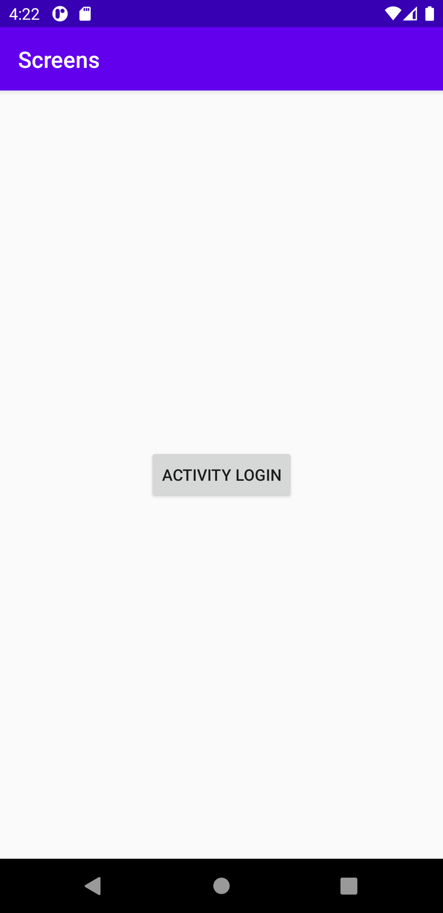

# Rapport för uppgift 3: Screens

Den andra aktiviteten lades till genom att skapa filen LoginActivity.java som medförde filen activity_login.xml . En lade i och med detta också till koden nedan i AndroidManifest.xml för att säga till vilken aktivitet som skulle köras och i vilken ordning.
```
<activity android:name=".LoginActivity">
    <intent-filter>
        <action android:name="android.intent.action.MAIN" />

        <category android:name="android.intent.category.LAUNCHER" />
    </intent-filter>
</activity>
```
Den andra sidan skulle inte visa vidare till någon ny _screen_ och _intent_ togs därav bort från aktiviteten kallad MainActivity.


För att skapa knappen på första _screen_ bytten en ut TextView i activity_login.xml mot Button och därefter gick en till LoginActivity.java och importerade tre bibliotek för att kunna lägga till och testa knappfunktionen.
```
Button buttonLogin = findViewById(R.id.button_login);
buttonLogin.setOnClickListener(new View.OnClickListener() {
    @Override
    public void onClick(View v) {
        Log.d("TAG","Hej!");
    }
});
```
```
import android.util.Log;
import android.view.View;
import android.widget.Button;
```


För att göra så att en kunde gå vidare till _screen_ nummer två behövdes en _intent_ skapas på sidan LoginActivity.java. Genom intent sägs att en befinner sig på LoginActivity och sedan ska gå till MainActivity. Även här behövdes ett bibliotek importeras.
```
import androidx.appcompat.app.AppCompatActivity;
```
```
Intent intent = new Intent(LoginActivity.this,MainActivity.class);
startActivity(intent);
```


_Fragmentet_ skapades genom filen BlankFragment.java och _fragmentet_ lades till i activity_main.xml där även en _LinearLayout_ adderades.
```
<LinearLayout
        android:layout_width="wrap_content"
        android:layout_height="wrap_content"
        android:text="Hello World!"
        app:layout_constraintBottom_toBottomOf="parent"
        android:orientation="vertical"
        app:layout_constraintLeft_toLeftOf="parent"
        app:layout_constraintBottom_toBottomOf="parent"
        app:layout_constraintRight_toRightOf="parent"
        app:layout_constraintTop_toTopOf="parent" />
        app:layout_constraintTop_toTopOf="parent"
        >


        <fragment
            android:name="com.example.screens.BlankFragment"
            android:layout_width="match_parent"
            android:layout_height="200dp"
            android:tag="blank_fragment"
            />
```


_ImageView_ lades till i filen activity_main.xml eftersom den skulle ligga på _screen_ nummer två. Slutligen gjordes en justering av _layouten_. Texten i _fragment_ ändrades också i filen strings.xml.
```
<ImageView
            android:id="@+id/id_night_sky"
            android:layout_width="wrap_content"
            android:layout_height="wrap_content"
            android:layout_marginLeft="20dp"
            android:layout_marginRight="20dp"
            android:contentDescription="Night sky"
            app:srcCompat="@drawable/star_sky" />
```
```
<string name="hello_blank_fragment">This is the blank fragment saying that this image is from Mammoth Hot Springs.</string>
```


_Screen_ nummer ett såg tillslut ut på följande vis.

_Screen_ nummer två såg tillslut ut på följande vis.
